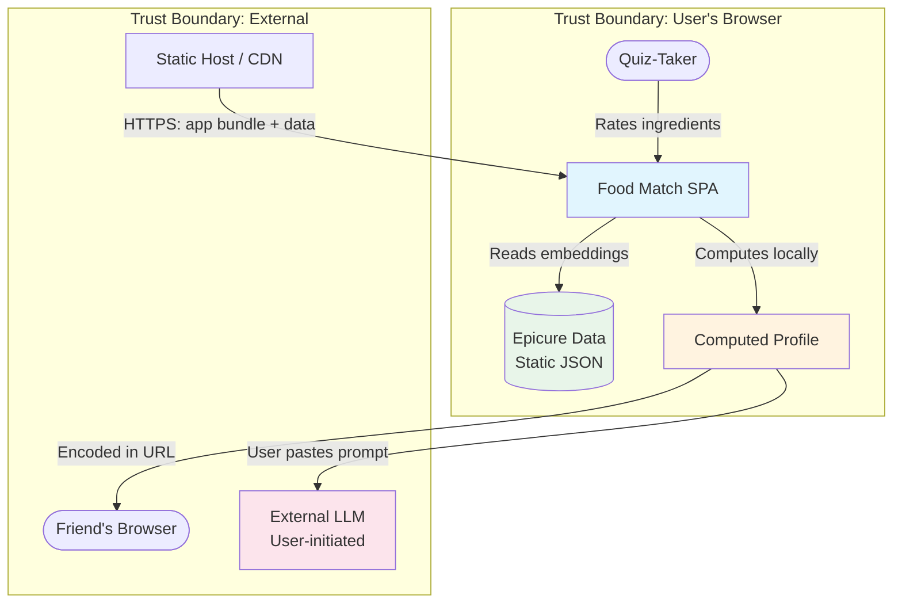

# Architecture

## Nouns and Verbs

**Nouns (what the system manages):**
- **Ingredient** — one of 1,790 canonical entries with a 300-dim embedding vector, cuisine direction projections, and mode memberships
- **Card** — one of 30 quiz ingredients, bundled with its display name, context line, and embedding reference
- **Rating** — a user's response to one card: +1, 0, -1, or skipped
- **Profile** — computed from ratings: 8 cuisine scores, top mode affinities, contributing ingredients per direction
- **Comparison** — the result of overlaying two profiles: shared ground, conflicts, bridges

**Verbs (what happens):**
- **Rate** — user responds to a card
- **Score** — compute profile from ratings × embeddings
- **Encode/Decode** — serialize profile to/from URL
- **Compare** — overlay two profiles to produce compatibility output

## Tech Stack

**Vite + React + TypeScript.** Rationale:
- React's component model maps directly to the card → profile → comparison view flow
- TypeScript catches errors in the linear algebra (dot products, normalization)
- Vite produces a fast static bundle with zero runtime server dependency
- Deploys to any static host (Vercel, Netlify, GitHub Pages)

**No backend. No database. No external APIs in the core flow.**

## Components

```
┌─────────────────────────────────────────────────────┐
│  Static Assets (bundled at build time)              │
│  ┌─────────────┐  ┌──────────────┐  ┌───────────┐ │
│  │ quiz-deck   │  │ embeddings   │  │ mode-atlas │ │
│  │ (30 cards)  │  │ (30 × 300)   │  │ (~150)     │ │
│  └─────────────┘  └──────────────┘  └───────────┘ │
│  ┌──────────────────┐                              │
│  │ cuisine-vectors   │                              │
│  │ (8 × 300)         │                              │
│  └──────────────────┘                              │
└─────────────────────────────────────────────────────┘

┌─────────────────────────────────────────────────────┐
│  App Shell (React)                                  │
│  ┌──────────┐  ┌─────────┐  ┌────────────────────┐ │
│  │ Context  │→ │  Quiz   │→ │  Profile / Compare │ │
│  │ (intro)  │  │ (cards) │  │  (results)         │ │
│  └──────────┘  └─────────┘  └────────────────────┘ │
└─────────────────────────────────────────────────────┘

┌─────────────────────────────────────────────────────┐
│  Scoring Engine (pure functions, no side effects)   │
│  ┌───────────────┐  ┌──────────────┐  ┌─────────┐ │
│  │ buildProfile  │  │ encodeURL    │  │ compare │ │
│  │ (ratings →    │  │ decodeURL    │  │ (A,B →  │ │
│  │  profile)     │  │ (profile ↔   │  │ compat) │ │
│  │               │  │  hash)       │  │         │ │
│  └───────────────┘  └──────────────┘  └─────────┘ │
└─────────────────────────────────────────────────────┘
```

### Data Layer (static JSON, bundled)

Only the 30 quiz ingredients' embeddings ship with the app (~30 × 300 floats = ~36KB as float32, ~9KB gzipped). We don't need all 1,790 embeddings — just the quiz deck's.

| Asset | Contents | Size (approx) |
|-------|----------|---------------|
| `quiz-deck.json` | 30 cards: name, context line, embedding index | <1KB |
| `embeddings.json` | 30 × 300 float matrix | ~36KB raw, ~9KB gzip |
| `cuisine-vectors.json` | 8 × 300 direction vectors + labels | ~10KB raw |
| `mode-atlas.json` | ~150 modes: label, top member ingredients, centroid index | ~15KB |
| `mode-centroids.json` | ~150 × 300 centroid matrix (for scoring) | ~180KB raw, ~60KB gzip |

**Total bundle (gzipped): ~80-100KB** of Epicure data. Loads instantly.

### Quiz Component

State machine with three phases:
1. **intro** — context screen explaining Epicure and how the quiz works
2. **rating** — card stack, one at a time, progress bar, collects Rating[]
3. **complete** — triggers scoring

Each card renders: ingredient name, context line, three rating buttons, skip. Animations between cards (swipe or fade) for polish.

### Scoring Engine (pure TypeScript module)

```typescript
// Core computation
function buildProfile(ratings: Rating[], embeddings: Float32Array[], cuisineVectors: Float32Array[], modeCentroids: Float32Array[]): Profile

// Profile structure
interface Profile {
  cuisineScores: { direction: string; score: number; topContributors: string[] }[]
  modeAffinities: { modeId: string; label: string; score: number; examples: string[] }[]
}
```

**Algorithm:**
1. Filter out skipped ratings
2. For each rated ingredient, multiply its 300-dim embedding by the rating value (+1/0/-1)
3. Sum into a preference vector (300-dim)
4. Normalize the preference vector
5. Dot product against each of 8 cuisine direction vectors → cuisine scores
6. Dot product against each mode centroid → mode affinities
7. For each top cuisine: identify which rated ingredients had highest projection onto that direction (the "because" contributors)
8. Return top 2-3 cuisines and top 3-5 modes

### URL Encoding

**Format:** `https://foodmatch.app/#p=<base64payload>`

**Payload structure (binary, then base64):**
- Version byte (1 byte) — future-proofing
- 8 cuisine scores as uint8 (0-255 quantized from normalized float) = 8 bytes
- Number of mode entries (1 byte)
- Per mode: mode index uint8 + score uint8 = 2 bytes × N modes

**Total:** 1 + 8 + 1 + (2 × 5) = 20 bytes → ~28 characters base64

Full URL: `https://foodmatch.app/#p=AQIDBA...` — well under 100 characters. No truncation risk.

### Profile View

Renders a Profile object into human-readable output:
- Cuisine affinities as ranked list with "because" explanations
- Mode neighborhoods with their human labels + 3-4 example ingredients
- Dish suggestions derived from top modes (static mapping: mode → 2-3 iconic dishes)
- LLM prompt (template filled with the user's top cuisines and mode descriptions)
- Share button (copies URL to clipboard)

### Comparison View

When the app detects both:
- A decoded profile in the URL hash (the friend's profile)
- A freshly-computed profile (the current user just finished the quiz)

It renders the Comparison:
- **Shared ground:** Cuisine directions where both score in top 3. Modes where both have high affinity.
- **Conflicts:** Directions where score difference exceeds a threshold.
- **Bridges:** Modes where one person is high and the other is neutral (not negative).
- **Eat-together:** Pre-written suggestion templates filled with shared cuisine/mode data.

## Data Flow

```
User taps cards → Rating[] stored in React state
                        ↓
              buildProfile(ratings, data)
                        ↓
                   Profile object
                    ↓          ↓
            encodeURL()    render ProfileView
                ↓
        URL hash updated (shareable)

Friend opens link → decodeURL(hash) → friend's Profile
Friend takes quiz → their own Profile
                        ↓
              compare(myProfile, friendProfile)
                        ↓
                 Comparison object
                        ↓
               render ComparisonView
```

## Security Considerations

The threat surface is minimal (no backend, no stored data), but:

1. **URL decode safety:** The base64 payload is fixed-length binary. Decode into a typed array with bounds checking. Never interpret as strings or inject into DOM without sanitization.
2. **No eval or dynamic execution:** Profile data is numeric scores. Never used to construct code or HTML.
3. **Content Security Policy:** Static site with strict CSP headers (no inline scripts, no external origins except the host).
4. **Attribution:** CC-BY-4.0 notice for Epicure data visible in footer/about section.

## Threat Model



**Threats identified:**

| # | Threat | Severity | Mitigation |
|---|--------|----------|------------|
| T1 | Malicious URL payload (crafted base64) | Low | Fixed-length decode with bounds checking; numeric-only interpretation |
| T2 | CDN compromise (tampered bundle) | Low | Subresource integrity hashes; HTTPS only |
| T3 | LLM prompt injection via profile data | Low | Profile data is numeric scores, not user-supplied text. LLM prompt template is app-controlled |
| T4 | Privacy: quiz responses inferred from shared URL | Low | URL contains only aggregated scores, not individual ratings |

## Deployment

Static build output (`dist/`) deployable to any static host:
- `npm run build` → produces `dist/` with index.html, JS bundle, and JSON data
- No environment variables needed
- No server runtime needed
- Works offline after first load (can add service worker later)

## Open Architectural Questions

1. **Dish suggestion mapping:** Need a static mode → dishes lookup. Can be hand-curated for the ~20 modes that users will actually see as top results.
2. **Mode centroid computation:** The mode_atlas CSV gives member lists, not centroids. Centroids need to be precomputed from member embeddings at build time (one-time script).
3. **Ingredient selection:** The specific 30 ingredients need to be chosen from the Epicure data. Criteria: recognizable, well-separated across cuisine directions, not too niche. This is a build-time data curation task.
